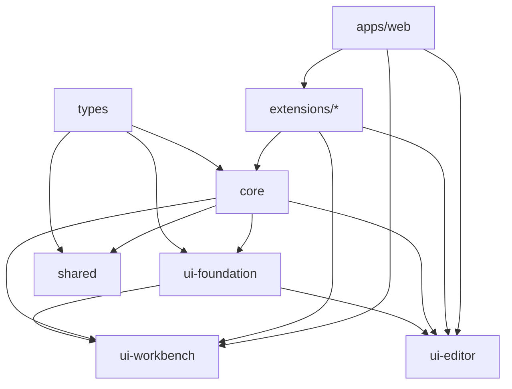

# 🏗️ Molecule 3.x 架构重构计划

## 📋 新的目录结构设计

```
packages/
├── types/                          # 🏷️  统一类型定义包
│   ├── src/
│   │   ├── core/                   # 核心类型
│   │   │   ├── editor.ts
│   │   │   ├── layout.ts
│   │   │   ├── theme.ts
│   │   │   └── index.ts
│   │   ├── ui/                     # UI组件类型
│   │   │   ├── components.ts
│   │   │   ├── events.ts
│   │   │   └── index.ts
│   │   ├── extensions/             # 扩展系统类型
│   │   │   ├── plugin.ts
│   │   │   ├── contribution.ts
│   │   │   └── index.ts
│   │   └── index.ts
│   └── package.json
│
├── core/                           # 🔧 核心业务逻辑包
│   ├── src/
│   │   ├── foundation/             # 基础设施层
│   │   │   ├── di/                 # 依赖注入
│   │   │   ├── events/             # 事件系统
│   │   │   ├── lifecycle/          # 生命周期管理
│   │   │   └── utils/              # 核心工具函数
│   │   ├── services/               # 服务层
│   │   │   ├── editor/             # 编辑器服务
│   │   │   ├── layout/             # 布局服务
│   │   │   ├── theme/              # 主题服务
│   │   │   ├── i18n/               # 国际化服务
│   │   │   ├── notification/       # 通知服务
│   │   │   ├── command/            # 命令服务
│   │   │   └── search/             # 搜索服务
│   │   ├── stores/                 # 状态管理
│   │   │   ├── editor/             # 编辑器状态
│   │   │   ├── layout/             # 布局状态
│   │   │   ├── theme/              # 主题状态
│   │   │   └── index.ts
│   │   ├── extensions/             # 扩展系统
│   │   │   ├── manager.ts          # 扩展管理器
│   │   │   ├── registry.ts         # 扩展注册表
│   │   │   ├── loader.ts           # 扩展加载器
│   │   │   └── api.ts              # 扩展API
│   │   └── index.ts
│   └── package.json
│
├── ui-foundation/                  # 🎨 UI基础包
│   ├── src/
│   │   ├── primitives/             # 原始UI组件
│   │   │   ├── button/
│   │   │   ├── input/
│   │   │   ├── dialog/
│   │   │   ├── dropdown/
│   │   │   └── index.ts
│   │   ├── compositions/           # 复合组件
│   │   │   ├── command-palette/
│   │   │   ├── context-menu/
│   │   │   ├── modal/
│   │   │   └── index.ts
│   │   ├── hooks/                  # 通用Hooks
│   │   │   ├── use-theme.ts
│   │   │   ├── use-shortcuts.ts
│   │   │   ├── use-accessibility.ts
│   │   │   └── index.ts
│   │   ├── providers/              # 上下文提供者
│   │   │   ├── theme-provider.tsx
│   │   │   ├── i18n-provider.tsx
│   │   │   └── index.ts
│   │   ├── utils/                  # UI工具函数
│   │   │   ├── cn.ts
│   │   │   ├── responsive.ts
│   │   │   └── index.ts
│   │   └── styles/                 # 样式文件
│   │       ├── globals.css
│   │       ├── components.css
│   │       └── themes/
│   └── package.json
│
├── ui-workbench/                   # 🖥️  工作台UI包
│   ├── src/
│   │   ├── components/
│   │   │   ├── layout/             # 布局组件
│   │   │   │   ├── workbench.tsx
│   │   │   │   ├── sidebar.tsx
│   │   │   │   ├── panel.tsx
│   │   │   │   └── status-bar.tsx
│   │   │   ├── navigation/         # 导航组件
│   │   │   │   ├── activity-bar.tsx
│   │   │   │   ├── menu-bar.tsx
│   │   │   │   └── breadcrumb.tsx
│   │   │   ├── explorer/           # 资源管理器
│   │   │   │   ├── file-tree.tsx
│   │   │   │   ├── search-view.tsx
│   │   │   │   └── outline.tsx
│   │   │   └── index.ts
│   │   ├── hooks/                  # 工作台专用Hooks
│   │   ├── stores/                 # 工作台状态
│   │   └── index.ts
│   └── package.json
│
├── ui-editor/                      # ✏️  编辑器UI包
│   ├── src/
│   │   ├── components/
│   │   │   ├── editor/             # 编辑器组件
│   │   │   │   ├── monaco-editor.tsx
│   │   │   │   ├── diff-editor.tsx
│   │   │   │   └── custom-editor.tsx
│   │   │   ├── tabs/               # 标签页组件
│   │   │   │   ├── tab-bar.tsx
│   │   │   │   ├── tab.tsx
│   │   │   │   ├── tab-group.tsx
│   │   │   │   └── stacked-tabs.tsx
│   │   │   ├── panels/             # 面板组件
│   │   │   │   ├── editor-pane.tsx
│   │   │   │   ├── split-view.tsx
│   │   │   │   └── resizable-panel.tsx
│   │   │   └── index.ts
│   │   ├── obsidian/               # Obsidian风格编辑器
│   │   │   ├── layout.tsx
│   │   │   ├── linked-views.tsx
│   │   │   ├── workspace-manager.tsx
│   │   │   └── index.ts
│   │   ├── hooks/                  # 编辑器专用Hooks
│   │   ├── stores/                 # 编辑器状态
│   │   ├── utils/                  # 编辑器工具
│   │   └── index.ts
│   └── package.json
│
├── extensions/                     # 🔌 扩展包集合
│   ├── welcome/                    # 欢迎页扩展
│   ├── settings/                   # 设置扩展
│   ├── terminal/                   # 终端扩展
│   └── file-manager/               # 文件管理扩展
│
└── shared/                         # 🤝 共享工具包
    ├── src/
    │   ├── utils/                  # 通用工具函数
    │   │   ├── storage.ts
    │   │   ├── performance.ts
    │   │   ├── validation.ts
    │   │   └── index.ts
    │   ├── constants/              # 常量定义
    │   ├── errors/                 # 错误处理
    │   └── testing/                # 测试工具
    └── package.json

apps/
├── web/                            # 🌐 Web应用
├── desktop/                        # 🖥️  桌面应用 (未来)
└── docs/                           # 📚 文档站点
```

## 🎯 重构原则

### 1. **分层架构**
- **Foundation Layer**: 基础设施和框架无关的核心逻辑
- **Service Layer**: 业务服务和状态管理
- **UI Layer**: 用户界面组件和交互
- **Extension Layer**: 插件和扩展系统

### 2. **依赖方向**
```
Extensions → Core Services → Foundation
     ↓            ↓             ↓
UI Components → UI Foundation → Shared Utils
```

### 3. **模块职责**
- **types**: 统一的类型定义，所有包的类型规范
- **core**: 核心业务逻辑，框架无关
- **ui-foundation**: 基础UI组件和工具
- **ui-workbench**: 工作台相关UI组件
- **ui-editor**: 编辑器相关UI组件
- **shared**: 通用工具和常量
- **extensions**: 可插拔的功能扩展

### 4. **设计模式**
- **依赖注入**: 服务解耦和测试友好
- **事件驱动**: 组件间松耦合通信
- **插件架构**: 可扩展的功能体系
- **状态管理**: 统一的状态管理策略

## 📦 包依赖关系



## 🚀 迁移策略

1. **阶段1**: 创建新的包结构和基础类型
2. **阶段2**: 重构核心服务层
3. **阶段3**: 迁移UI组件到新结构
4. **阶段4**: 重新设计状态管理
5. **阶段5**: 完善扩展系统
6. **阶段6**: 清理旧代码和优化

每个阶段都保持向后兼容，确保项目在重构过程中可以正常运行。